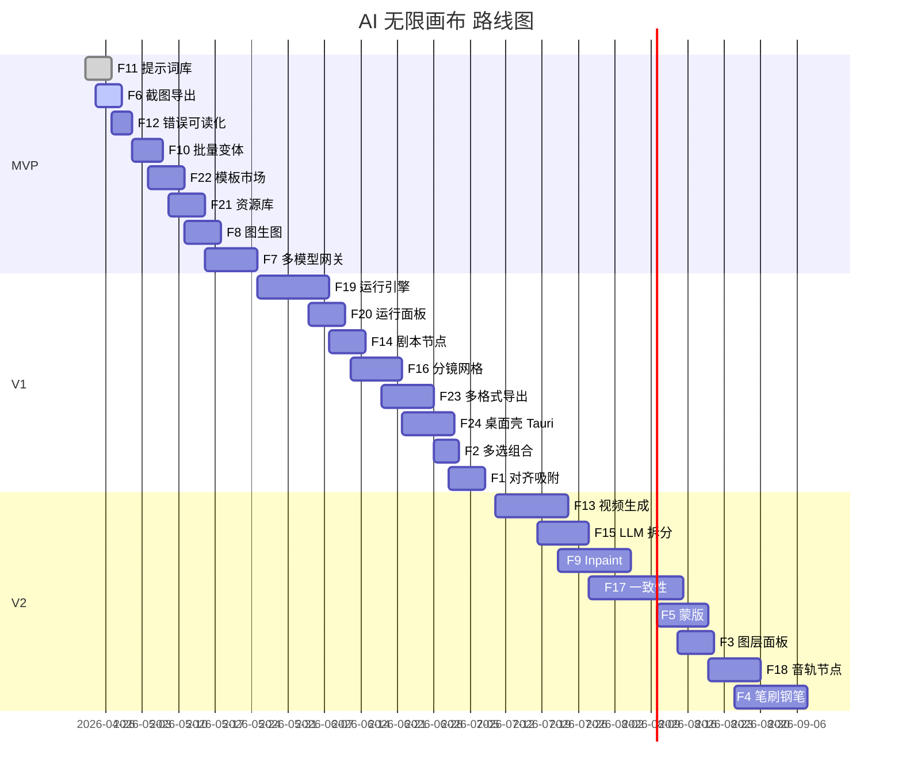

# AI 无限画布 —— 产品需求文档（PRD）

- 文档版本：v0.1（MVP 立项）
- 更新日期：2026-04-22
- 关联：[roadmap-RICE.md](./roadmap-RICE.md) · [design-spec.md](./design-spec.md) · [高保真原型](../prototype/index.html)

## 1. 产品背景与定位

### 1.1 一句话定位
> **AI 无限画布** 是一款面向单人创作者的桌面级无限画布应用，在同一张画布上同时完成 *AI 多模态生成工作流* 与 *叙事/分镜排版*，所有成果默认本地存储、可离线工作、可云同步。

### 1.2 为什么再做一个画布
| 竞品 | 强项 | 短板 | 我们的空位 |
| - | - | - | - |
| Krea AI Canvas | 实时绘图 + AI | 节点连接弱、叙事缺失 | 补节点图 + 分镜 |
| Invoke AI Canvas | Inpaint / 图层 | 只围绕 SD 单模型 | 多模型网关 |
| ComfyUI | 节点化强、可扩展 | UI 晦涩，面向工程师 | 人类友好的节点图 |
| tldraw / Figjam / Miro | 白板协作 | AI 是插件、不原生 | AI 是一等公民 |
| Boords / Storyboarder | 分镜专用 | 无 AI 生成能力 | AI + 分镜合一 |

### 1.3 差异化三件套
1. **节点是一等公民**：任一元素都可以有输入/输出端口，连线即生成链。
2. **AI 是底座，不是插件**：网关层默认统一文/图/视/音 API，不绑定单家。
3. **叙事模式零切换**：同一张画布既是工作流也是分镜板，只是视图模式不同。

## 2. 目标用户与典型场景

### 2.1 画像
- **P1. AI 产品爱好者（占比 ~45%）** —— 喜欢折腾新模型，需要自由组合节点做个人项目。
- **P2. 独立视觉创作者 / 设计师（~35%）** —— 需要快速 moodboard、概念图、变体探索，对导出/排版敏感。
- **P3. 短视频 / 漫画 / 视觉小说作者（~20%）** —— 写剧本、拆分镜、生成关键帧与配音，最关注一致性与叙事顺畅。

### 2.2 三条端到端场景（End-to-End Journey）

#### 场景 A：P1 做概念图探索（MVP 覆盖）
1. 打开空白画布 → 从模板市场选 "AI Moodboard 起手"。
2. 画布上预置 "关键词 → 4 张图 → 放大 1 张 → 做 4 张变体" 的节点链。
3. 用户替换提示词 → 点运行 → 30 秒后左→右依次生成。
4. 用右键菜单把结果拖到画布空白处、选中 → 截图导出。

#### 场景 B：P2 做 Brand 视觉方向（V1 覆盖）
1. 新画布 → 上传 10 张参考图进资源库。
2. 拖 3 张到画布，挂到 "图生图 + 风格预设" 节点上做 12 张变体。
3. 多选 → 组 → 对齐 → 导出 PDF 给客户。

#### 场景 C：P3 做 30 秒竖屏短视频分镜（V2 覆盖）
1. 新画布 → 切到 "分镜模式" → 粘贴剧本。
2. "剧本 → 分镜拆分" 节点自动切出 6 个 scene。
3. 每个 scene 有 "参考角色图 + 提示词 + 图生图 + 视频生成" 链。
4. 点画布级 "运行"，工作流按拓扑执行；运行完 → 一键 MP4 拼接导出。

## 3. 产品原则

1. **本地优先（Local-first）**：所有工作不需要登录即可完成；云同步是可选增强，不是依赖。
2. **节点可运行（Nodes are executable）**：节点不是只呈现结果，连线本身就是任务图。
3. **AI 可插拔（Pluggable AI）**：模型、API Key、端点都是用户可配置的"驱动"，不是被锁死的服务。
4. **极简默认 / 深度可展开**：新用户看到的控件不超过 5 个；`…` 展开可见全部参数。
5. **Esc 永远回到最安全状态**：任何模式按 Esc 都回到"选择 + 无选中 + 未运行"。

## 4. 核心功能模块

本节对齐 [roadmap-RICE.md](./roadmap-RICE.md) 的 ID。对每个特性给出"一句话描述 + 核心验收标准"（Given/When/Then）。

### 4.1 画布底座（BASE）

#### BASE-01 无限画布（已有）
- 用户可平移/缩放，画布无边界，坐标用 float。
- Given：空画布。When：滚轮 + Space 拖动。Then：视窗在 [0.1x, 4x] 区间自由缩放，不丢帧 / 60fps。

#### F1 对齐吸附 / 智能参考线（V1）
- 移动/缩放节点时，边缘、中心、固定间距自动吸附已选 + 邻近节点。
- Given：画布有 ≥ 2 节点。When：拖动 A 使其某条边距 B 的某条边 ≤ 4px。Then：出现紫色参考线并吸附。

#### F2 多选组合（V1）
- 框选、Shift 增选、Ctrl+G 成组、Ctrl+Shift+G 解组。
- Given：选中 ≥ 2 元素。When：Ctrl+G。Then：形成 Group，整体拖拽，双击进入组内编辑。

#### F3 图层管理（V2）
- 右侧抽屉展示层级树，支持 z 排序、锁定、隐藏、重命名。

#### F4 笔刷 / 钢笔（V2）
- 自由手绘 + 贝塞尔钢笔，产物为矢量节点，可作为 img2img 条件。

#### F5 蒙版 / 区域框选（V2）
- 在 image 节点上拉出 rect / freeform 蒙版，作为 F9 inpaint 的源区域。

#### F6 画布截图 / 区域导出 PNG（MVP）
- 工具栏 → 截图 → 用户拉框 → 立即下载 PNG（2x 分辨率）。
- Given：画布含元素。When：点"截图 PNG" + 拉框。Then：弹出保存 → 产物像素 = 框宽 × 2。

### 4.2 AI 生成（AI）

#### F7 多模型 AI 网关（MVP）
- 支持 OpenAI / t8star / Replicate / 自定义 HTTP 四种驱动；模型 + Key + base_url 在 SettingsModal 集中管理。
- Given：已在 Settings 配置 ≥ 1 个 provider。When：NodeInputBar 点"模型"下拉。Then：列出所有已启用模型，按能力标签（text / image / video / audio）分组。
- 失败态：provider 缺失或 Key 错误 → 节点红框 + "去设置" 按钮。

#### F8 图生图 Image-to-Image（MVP）
- image 节点可接一根"图入"到另一个 image 节点，复用 prompt + strength。
- 验收：strength 默认 0.65，可在节点菜单调 0–1 滑条。

#### F9 Inpaint / Outpaint（V2）
- 依赖 F5 蒙版；蒙版区域重绘或向外扩画 25%/50%/100%。

#### F10 批量变体生成（MVP）
- NodeInputBar 的 "count" 切成 1/2/4/6/9，生成后在原节点下方以网格展现，用户点任一张即"提升为正式节点"。

#### F11 提示词库 / 风格预设（MVP）
- 内建 50+ 预设（摄影/插画/产品/国风/3D 等），支持收藏自定义 prompt。
- 验收：NodeInputBar 左下出现"书本"图标，点开抽屉。选中即拼接到当前 prompt 并高亮 token。

#### F12 失败重试与错误可读化（MVP）
- 所有 AI 调用带指数退避重试（0.5s → 1s → 2s，最多 3 次），失败后节点显示分类错误（限流 / 审核 / 密钥 / 网络 / 未知）+ "重试 / 改 prompt / 看日志" 三键。

#### F13 视频生成节点（V2）
- 文生视频 / 图生视频；默认 6s 竖屏，生成期间节点内嵌 loading 条 + 预估完成时间。

### 4.3 叙事 / 分镜（NARRATIVE）

#### F14 剧本节点（V1）
- 一个体量更大的 text 节点，支持 Markdown 风格的 "### 场 1 / 场 2 …" 自动识别为分镜锚点。

#### F15 LLM 剧本 → 分镜自动拆分（V2）
- 剧本节点右键 → "拆分镜头"。后端调 LLM 产出 JSON（scene / shot / desc / suggested prompt），在画布上生成 N 个 scene 节点。

#### F16 分镜网格视图（V1）
- 画布右上角切换 "画布 / 分镜"。分镜视图以卡片网格展示所有 scene 节点，像漫画分镜表。
- 验收：切换动画 ≤ 300ms；两视图数据完全互通，任一处改都反映到另一处。

#### F17 角色 / 场景一致性（V2）
- scene 节点可绑定 "角色参考图"，在 F8/F13 调用时自动作为 reference / LoRA hint。

#### F18 音轨 / 配音节点（V2）
- 文本 → TTS，或 BGM 生成；可拖到 scene 节点上作为伴奏。

### 4.4 执行引擎（RUN）

#### F19 节点链式运行引擎（V1）
- 后端以拓扑序对选中子图执行；节点 5 状态（idle / queued / running / success / failed）。支持局部重跑。
- 验收：有环 → 弹 toast 拒绝运行；执行失败不阻断其它分支。

#### F20 运行面板（V1）
- 画布右侧滑出面板，实时日志、节点进度条、耗时、取消按钮。

### 4.5 资源与模板（ASSET）

#### F21 资源库（MVP）
- 左侧抽屉，三 Tab：素材 / 最近生成 / 收藏；拖入画布即生成对应节点。

#### F22 模板市场（MVP）
- 内建 6 套起手模板：空白 / AI Moodboard / 产品图变体 / 短视频分镜 / 角色三视图 / 风格迁移实验。V1 开始支持社区模板 JSON 导入。

### 4.6 导出（EXPORT）

#### F23 多格式导出（V1）
- PNG / PDF（按分镜顺序排版）/ MP4（按 scene 顺序拼接，F13 前用占位黑屏）/ ZIP（画布 JSON + 素材）。

### 4.7 工程与平台（PLATFORM）

#### F24 桌面壳 Tauri（V1）
- Web 同源构建为 Tauri 桌面应用，Mac / Win。首次启动内置全部前端，本地文件作为 `.canvas` 后缀关联。

## 5. 非功能需求

### 5.1 性能预算
- **渲染**：100 节点、3 条并行运行链，FPS ≥ 55。
- **首屏**：Web 冷启动 → 可交互 < 2.5s（宽带 100Mbps 本地 dev server）。
- **AI 调用**：图像生成 P95 ≤ 25s；视频 P95 ≤ 90s；超时自动走 F12。

### 5.2 存储
- 默认 IndexedDB（升级自现有 `localStorage`，配 v2→v3 迁移）。
- 单画布上限：500 节点 / 500MB。超过阈值提示 "拆画布"。
- 云同步（V2）走端到端加密，文档 diff 合并。

### 5.3 安全
- API Key 使用 Web Crypto + 用户本地口令加密；导出 ZIP 默认剔除 Key。
- LLM / 生成结果不回传服务端（除非用户开"云同步"）。

### 5.4 可访问性
- 关键路径（新建节点 / 设置 / 运行）键盘全可达。
- 对比度 WCAG AA；所有按钮有 aria-label 或 title。

### 5.5 国际化
- MVP 仅中文 zh-CN；V1 加英文；资源库文案与模板支持 i18n JSON。

## 6. 成功指标

| 指标 | 目标 | 口径 |
| - | - | - |
| 首次生成成功率 | ≥ 90% | 新用户建首个 AI 节点后 10 分钟内有 ≥ 1 次成功生成 |
| 7 日留存 | ≥ 35% | 激活日起第 7 日返回 |
| 人均节点数（7 日） | ≥ 20 | 去重元素 |
| AI 调用成功率 | ≥ 95% | 所有 AI 请求，5xx + 业务失败归为失败 |
| 导出 / 分享转化 | ≥ 40% | 激活后 7 日内触发任一导出 |

## 7. 路线图（与 RICE 一致）

## 8. 边界与不做

- 不做多人实时协同 / 权限体系 / SaaS 结算。
- 不做移动端（PC 优先，平板以下体验不保证）。
- 不做自研扩散模型；只做 gateway + 编排。
- 不做插件市场；自定义模型走 F7 的 "Custom HTTP Provider"。

## 9. 风险与对策

| 风险 | 等级 | 对策 |
| - | - | - |
| 第三方 AI 服务不稳定 | 高 | F12 统一错误 + F7 多 provider 热切换 |
| 单画布文档超出 IndexedDB 限制 | 中 | 分片存储 + "另存为新画布" 引导 |
| 视频生成成本高用户不用 | 中 | V2 再上，先用 Mock + 6s 预设压成本 |
| 模板市场冷启动 | 中 | MVP 内建 6 套 + 官方持续更新 |
