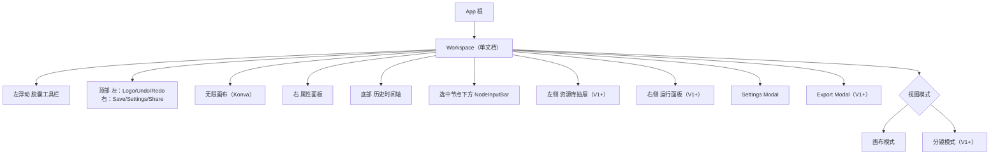
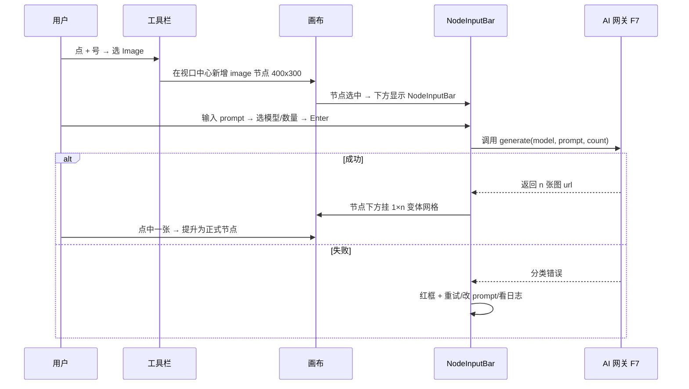
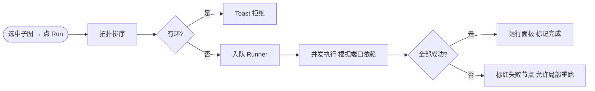
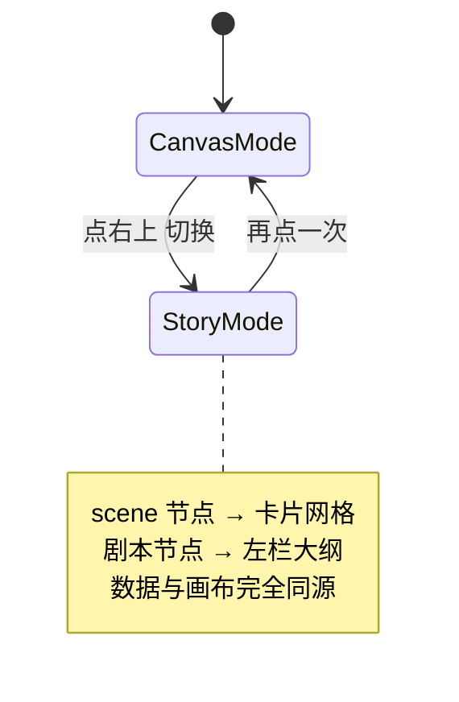

# AI 无限画布 —— 设计规格文档

- 关联：[PRD.md](./PRD.md) · [roadmap-RICE.md](./roadmap-RICE.md) · [高保真原型](../prototype/index.html)
- 面向：UI / 交互设计与前端实现

## 1. 信息架构（IA）



## 2. 交互主流程

### 2.1 新建 AI 节点 → 生成（MVP 核心）



### 2.2 链式运行（V1）



### 2.3 分镜模式切换（V1）



## 3. 页面/视图布局

### 3.1 Canvas 主视图（默认）

```
+----------------------------------------------------------------------+
|  Logo  AI画布Pro  未命名设计.canvas   ⟲ ⟳       SaveStatus ⚙ ✨ 分享 |
|                                                                       |
|   +                                             [Properties Panel]    |
|   □                                              Element Type         |
|   ○          . . . . . . . . . . . . . . .      X/Y  W/H              |
|   📝              (NodeInputBar 在选中节点下方)   Fill / Font          |
|   ━                                                                    |
|                                                                       |
|                         [History Drawer 底部]                          |
+----------------------------------------------------------------------+
```

- **左胶囊工具栏**：浮动 40px，间距 8px，+ 号展开抽屉（节点 + 工具）。
- **右属性面板**：宽 280px，仅当有选中时可见；无选中时塌陷为图标条。
- **底部历史抽屉**：默认隐藏 40px 高 tab，hover 展开 240px。
- **NodeInputBar**：选中节点且 `scale ≥ 0.5` 时出现；锚定于节点底边 +10px。

### 3.2 分镜模式（V1）

```
+----------------------------------------------------------------------+
| 剧本大纲                   | 分镜卡片网格 4 列                          |
| ### 场1  内景·公寓·夜       | ┌──────┐  ┌──────┐  ┌──────┐  ┌──────┐  |
|   ...                      | │scene1│  │scene2│  │scene3│  │scene4│  |
| ### 场2  外景·街·黎明      | └──────┘  └──────┘  └──────┘  └──────┘  |
|   ...                      | ┌──────┐  ┌──────┐                       |
|                            | │scene5│  │scene6│                       |
|                            | └──────┘  └──────┘                       |
+----------------------------------------------------------------------+
```

### 3.3 运行面板（V1）

```
┌──── 运行 / 2 个任务中 ────┐
│ ● scene1 → 图生图     2.1s │
│ ⏳ scene2 → 图生图    1/4  │
│ ⏳ scene3 → 视频生成  排队 │
│ ○ scene4 → 视频生成   待运行│
│                            │
│ [日志]                      │
│ 12:01:02 scene1 ok         │
│ 12:01:03 scene2 fetching…   │
│ [取消全部] [局部重跑]        │
└────────────────────────────┘
```

## 4. 设计令牌（Design Tokens）

> 延续现有视觉：紫 + 白卡片 + 细描边 + 小圆角。所有组件必须从此 token 取值。

### 4.1 颜色

| Token | HEX | 用途 |
| - | - | - |
| `--color-bg-canvas` | `#fafafa` | 画布底 |
| `--color-bg-app` | `#f0f2f5` | App 外框 |
| `--color-surface` | `#ffffff` | 浮层卡片 |
| `--color-surface-glass` | `rgba(255,255,255,0.9)` | 玻璃感面板 |
| `--color-border` | `#e5e7eb` | 描边 |
| `--color-border-strong` | `#d1d5db` | 强描边 |
| `--color-text` | `#1a1a1b` | 主文本 |
| `--color-text-muted` | `#6b7280` | 次文本 |
| `--color-text-faint` | `#9ca3af` | 辅助 |
| `--color-primary` | `#2563eb` | 主按钮 / 链接 |
| `--color-primary-hover` | `#1d4ed8` |  |
| `--color-accent` | `#8b5cf6` | AI 强调 / 参考线 |
| `--color-accent-soft` | `#ede9fe` | AI 状态底 |
| `--color-success` | `#10b981` |  |
| `--color-warn` | `#f59e0b` |  |
| `--color-error` | `#ef4444` |  |
| `--color-sticky` | `#fef08a` | 便签 |

### 4.2 字体

- 主字体：`ui-sans-serif, system-ui, "PingFang SC", "Microsoft YaHei", sans-serif`。
- 字号阶梯：`10 / 11 / 12 / 13 / 14 / 16 / 20 / 24`。
- 行高：字号 ≤ 14 → 1.4，≥ 16 → 1.3。

### 4.3 间距

`4 / 8 / 12 / 16 / 20 / 24 / 32 / 48`（px）

### 4.4 圆角

`4 / 8 / 10 / 12 / 16 / 20 / 999`（999 为胶囊/圆按钮）

### 4.5 阴影

| Token | 值 | 场景 |
| - | - | - |
| `--shadow-xs` | `0 1px 2px rgba(0,0,0,0.04)` | 扁平按钮 hover |
| `--shadow-sm` | `0 2px 6px rgba(0,0,0,0.06)` | 卡片 |
| `--shadow-md` | `0 8px 30px rgba(0,0,0,0.12)` | 悬浮面板 |
| `--shadow-lg` | `0 12px 40px rgba(0,0,0,0.12)` | NodeInputBar |
| `--shadow-xl` | `0 20px 60px rgba(0,0,0,0.15)` | 菜单弹层 |

### 4.6 动效

- 时长：`150ms` 反馈 / `240ms` 位移 / `320ms` 面板展开。
- 缓动：`cubic-bezier(.2,.8,.2,1)` 默认；`linear` 只用于 loading。
- NodeInputBar `transform: scale()` 使用 `transformOrigin: 'top left'`。

## 5. 组件规范（摘要）

### 5.1 Button
- 尺寸：`sm 24 / md 32 / lg 40`px 高。
- 变体：`primary` / `secondary` / `ghost` / `danger`。
- 所有 button 同时有 hover / active / disabled / focus-visible 四态。

### 5.2 Dropdown
- 触发器右侧 14px chevron；`maxLabelWidth` 生效时：`truncate + title` 给 tooltip。
- 选项高度 32px；当前选中左上挂蓝点。

### 5.3 Node 节点（画布内）
- 卡片底：`var(--color-surface)` + `var(--shadow-sm)`。
- 边框：默认 `1px solid var(--color-border)`；选中 `2px solid var(--color-primary)`。
- 端口：圆 8px，输入左中 / 输出右中；可由元数据扩展到顶/底。
- 五状态色（运行态）：idle 灰 · queued 蓝虚线 · running 紫 pulse · success 绿 · failed 红。

### 5.4 NodeInputBar
- 宽度：`max(element.width, 340)`（画布单位），外层 `transform: scale(stageConfig.scale)`。
- 内部两行：上 textarea + 生成按钮，下工具栏（model / aspect / quality / … / 更多 / 提交）。
- 仅当 `scale ≥ 0.5` 且节点被选中时渲染。

## 6. 键盘快捷键

| 分组 | 快捷键 | 动作 |
| - | - | - |
| 通用 | Esc | 清选择 + 回选择工具 |
| 通用 | Ctrl+Z / Ctrl+Shift+Z | 撤销 / 重做 |
| 通用 | Ctrl+Y | 重做 |
| 通用 | Delete / Backspace | 删除选中 |
| 添加 | T / I / V / A | 新建 文/图/视/音 节点 |
| 形状 | R / O / N | 矩形 / 圆形 / 便签 |
| 选区 | Shift+Click / 框选 | 增选 |
| 组 | Ctrl+G / Ctrl+Shift+G | 组合 / 解组（V1） |
| 视图 | 1 / 2 | 画布模式 / 分镜模式（V1） |
| 运行 | Ctrl+Enter | 运行选中子图（V1） |

## 7. 空态与错误态

| 场景 | 设计 |
| - | - |
| 空画布（新用户） | 中央卡片：插画 + "选个起手模板" + 6 张模板缩略 |
| 选中空工具 | 提示"点左侧 + 号新增节点，或按 T/I/V/A 快捷键" |
| AI 生成失败 | 节点红框 + 错误标签（限流 / 密钥 / 审核 / 网络 / 未知）+ 三键 |
| 断网 | 顶部横条 "已离线，AI 生成不可用。本地编辑保持有效。" |
| 存储满 | 弹 Modal："画布接近 500MB，建议另存为新画布或清理无用素材" |

## 8. 可访问性细节

- 颜色对比：`--color-text` 对 `--color-surface` 对比度 ≥ 12:1；`--color-text-muted` ≥ 4.5:1。
- 所有互动元素 focus-visible 2px `--color-primary` outline，不依赖颜色传递状态。
- 节点运行态同时带 icon + 文字 label（色盲友好）。

## 9. 与现有代码的映射表

| 设计元素 | 现有实现 | 文件 |
| - | - | - |
| 画布底 + 点阵 | `backgroundImage radial-gradient` + dot grid | `Canvas/src/App.tsx` |
| 左胶囊工具栏 | `ToolButton` + `MenuItem` | `Canvas/src/App.tsx` |
| 右属性面板 | `PropertiesPanel` | `Canvas/src/components/properties/PropertiesPanel.tsx` |
| 历史抽屉 | `HistoryPanel` | `Canvas/src/components/HistoryPanel.tsx` |
| 节点与端口 | `CanvasElements` | `Canvas/src/components/canvas/CanvasElements.tsx` |
| NodeInputBar | `NodeInputBar` | `Canvas/src/components/NodeInputBar.tsx` |
| 状态中心 | `useCanvasStore` + `useSettingsStore` | `Canvas/src/store/` |
| 类型约束 | `CanvasElement` | `Canvas/src/types/canvas.ts` |

## 10. 下一步：对齐原型

- 本规格 1–5 节的视觉在 [prototype/index.html](../prototype/index.html) 中完整呈现。
- 6 屏原型：Canvas 主视图 / NodeInputBar 模型网关 / 分镜模式 / 运行面板 / 资源库 / 导出。
