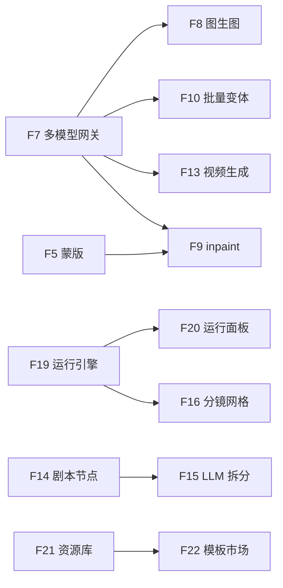

# AI 无限画布 —— RICE 路线图

> 产出对象：24 条候选特性。
> 打分模型：`RICE = Reach × Impact × Confidence / Effort`。
> 结果用于划分 MVP / V1 / V2 三档。

## 1. 打分约定

- **Reach（季度触达人数）**：产品季度活跃 1,000 人为基数，按该特性的使用率估算。
- **Impact**：3=核心差异化 / 2=显著体验提升 / 1=中等有用 / 0.5=边缘优化 / 0.25=极弱。
- **Confidence**：1.0=需求与实现都很确定；0.8=需求清楚、实现略有不确定；0.5=方向有推测或依赖外部不稳定能力（模型、第三方 API）。
- **Effort**：单人·周估算；本项目默认 1–2 人团队。
- **保留精度**：RICE 保留一位小数。同分按 `Effort 低→高`、`Confidence 高→低` 次序决胜。

## 2. 模块分布（24 条）

| 模块 | 条数 | 代表特性 |
| - | - | - |
| BASE 画布底座 | 6 | 对齐吸附、多选组合、图层、笔刷、蒙版、区域导出 |
| AI AI 生成 | 7 | 多模型网关、图生图、inpaint、批量变体、提示词库、失败重试、视频生成 |
| NARRATIVE 叙事分镜 | 5 | 剧本节点、LLM 拆分、分镜网格、一致性锚定、音轨节点 |
| RUN 链式执行 | 2 | 运行引擎、运行面板 |
| ASSET 资源模板 | 2 | 资源库、模板市场 |
| EXPORT 导出 | 1 | 多格式导出 |
| PLATFORM 工程 | 1 | 桌面壳 Tauri |

## 3. 完整打分表（按 RICE 降序）

| # | ID | 特性 | 模块 | Reach | Impact | Conf. | Effort(w) | RICE | 阶段 |
| - | - | - | - | - | - | - | - | - | - |
| 1 | F11 | 提示词库 / 风格预设 | AI | 800 | 2 | 1.0 | 1.0 | **1600.0** | MVP |
| 2 | F6 | 画布截图 / 区域导出 PNG | BASE | 800 | 2 | 1.0 | 1.5 | **1066.7** | MVP |
| 3 | F12 | 失败重试与错误可读化 | AI | 1000 | 1 | 1.0 | 1.0 | **1000.0** | MVP |
| 4 | F8 | 图生图 Image-to-Image | AI | 800 | 3 | 0.8 | 2.0 | **960.0** | MVP |
| 5 | F22 | 模板市场（Moodboard / Story / Workflow） | ASSET | 800 | 3 | 0.8 | 2.0 | **960.0** | MVP |
| 6 | F10 | 批量变体生成（n 张结果网格） | AI | 700 | 2 | 1.0 | 1.5 | **933.3** | MVP |
| 7 | F7 | 多模型 AI 网关 | AI | 1000 | 3 | 0.8 | 3.0 | **800.0** | MVP |
| 8 | F21 | 资源库（上传 / 最近 / 收藏） | ASSET | 700 | 2 | 1.0 | 2.0 | **700.0** | MVP |
| — | — | — MVP 切线（Top 8） — | — | — | — | — | — | — | — |
| 9 | F20 | 运行面板（进度 / 日志 / 取消） | RUN | 700 | 2 | 0.8 | 2.0 | 560.0 | V1 |
| 10 | F23 | 多格式导出 PNG / PDF / MP4 / ZIP | EXPORT | 700 | 2 | 0.8 | 2.0 | 560.0 | V1 |
| 11 | F2 | 多选组合 / Group | BASE | 600 | 1 | 1.0 | 1.5 | 400.0 | V1 |
| 12 | F16 | 分镜网格视图 | NARRATIVE | 400 | 3 | 0.8 | 2.5 | 384.0 | V1 |
| 13 | F19 | 链式运行引擎（拓扑调度 + 状态机） | RUN | 900 | 3 | 0.5 | 4.0 | 337.5 | V1 |
| 14 | F14 | 剧本节点（长文本 + 场次解析） | NARRATIVE | 400 | 2 | 0.8 | 2.0 | 320.0 | V1 |
| 15 | F24 | 桌面壳 Tauri 打包 | PLATFORM | 600 | 2 | 0.8 | 3.0 | 320.0 | V1 |
| 16 | F1 | 对齐吸附 / 智能参考线 | BASE | 700 | 1 | 0.8 | 2.0 | 280.0 | V1 |
| — | — | — V1 切线（9–16） — | — | — | — | — | — | — | — |
| 17 | F3 | 图层管理面板（z / 锁 / 隐藏） | BASE | 500 | 1 | 1.0 | 2.0 | 250.0 | V2 |
| 18 | F13 | 视频生成节点（Sora / Veo / Kling / Hunyuan） | AI | 600 | 3 | 0.5 | 4.0 | 225.0 | V2 |
| 19 | F15 | LLM 剧本 → 分镜自动拆分 | NARRATIVE | 400 | 3 | 0.5 | 3.0 | 200.0 | V2 |
| 20 | F9 | Inpaint / Outpaint | AI | 500 | 3 | 0.5 | 4.0 | 187.5 | V2 |
| 21 | F17 | 角色 / 场景一致性（参考图 + LoRA Hook） | NARRATIVE | 500 | 3 | 0.5 | 5.0 | 150.0 | V2 |
| 22 | F5 | 蒙版 / 区域框选（inpaint 源） | BASE | 400 | 2 | 0.5 | 3.0 | 133.3 | V2 |
| 23 | F18 | 音轨 / 配音节点 | NARRATIVE | 300 | 2 | 0.5 | 3.0 | 100.0 | V2 |
| 24 | F4 | 笔刷 / 钢笔工具 | BASE | 300 | 1 | 0.5 | 4.0 | 37.5 | V2 |

## 4. 分期说明

### MVP（当前 + 4 周）：产品能自洽闭环
聚焦"让一个人能从空白画布 → 生成可用成果 → 拿走"，补齐当前单一 `t8star` API 和零资源管理的明显短板。
- **F7 多模型网关** 是护城河，优先立架构。
- **F11 提示词库、F8 图生图、F10 批量变体、F22 模板** 直接拉激活与复用。
- **F21 资源库** 解决"第一次生成的图之后怎么找回来"。
- **F6 截图导出、F12 错误可读化** 是基本使用权。

### V1（+8 周）：从工具升级为工作流
交付"叙事分镜"差异化，同时把执行能力做硬。
- **F19 链式运行引擎 + F20 运行面板** 配合交付，决定节点图是否"真的会运行"。
- **F14 剧本 + F16 分镜网格** 是叙事模式最小可用版本。
- **F23 多格式导出、F2 多选、F1 对齐、F24 桌面包** 是工程感与口碑放大。

### V2（+16 周）：专业深度与多模态密度
- **F13 视频生成、F9 inpaint、F17 一致性、F18 音轨** 构成真正的多模态叙事产线。
- **F3 图层、F5 蒙版、F4 笔刷** 把画布补成"轻量设计工具"。

## 5. 依赖关系（不能单看 RICE 的那几处）

- **F7 是所有重型 AI 特性的前置**。即使 V2 才上 F13，F7 必须在 MVP 阶段把抽象打稳。
- **F19 运行引擎分数排到 V1 中段，但功能上是 F20 的前置**。实现时先引擎后面板，不按分数做切分。
- **F5 蒙版是 F9 inpaint 的前置**，两者同在 V2。

## 6. 不打分（先排除）

以下能力本轮直接删掉，不参与 RICE：

- 多人实时协同 / 光标同步 / 评论 —— 与 solo 定位冲突。
- 权限 / seat / 计费 —— 不做 B 端。
- 移动端响应式适配 —— 平板以下体验损失大于收益。
- 插件市场 / SDK —— 过早。

## 7. 成功指标挂钩

| 指标 | 目标值 | 主要由哪些特性驱动 |
| - | - | - |
| 新用户激活率（首次成功生成） | ≥ 70% | F7, F11, F12, F22 |
| 7 日留存 | ≥ 35% | F21, F22, F10, F8 |
| 人均节点数（7 日窗口） | ≥ 20 | F10, F22, F16 |
| AI 调用成功率 | ≥ 95% | F7, F12, F20 |
| 导出 / 分享转化 | ≥ 40% | F6, F23 |
